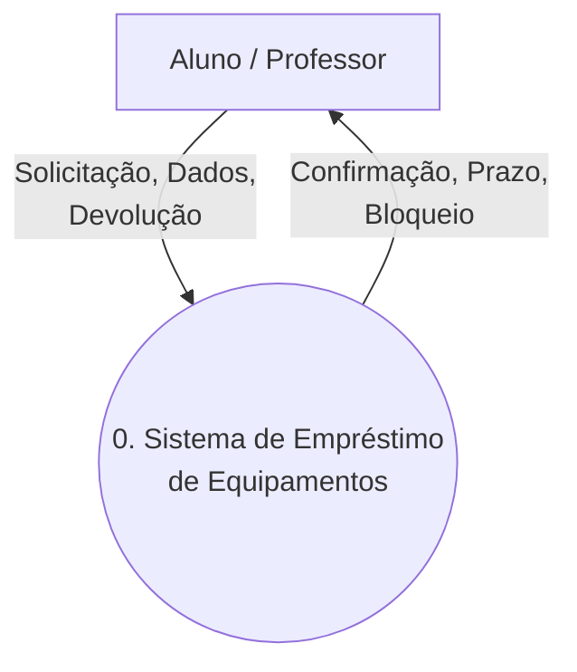
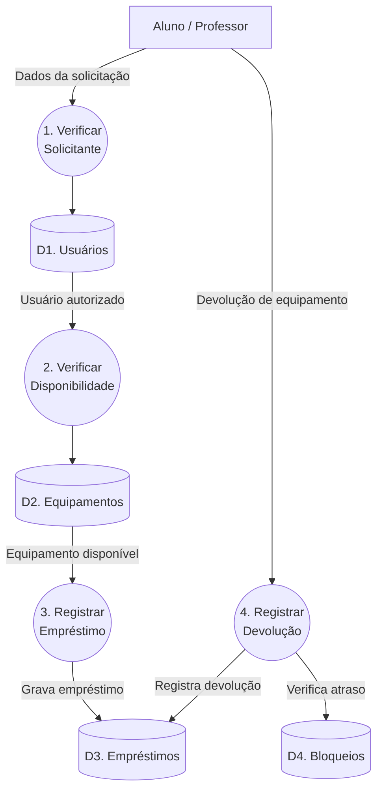

# Sistema de Empréstimo de Equipamentos do Laboratório 💻

Repositório destinado à entrega da atividade "Diagnóstico de Ferramental e Confronto de Paradigmas" da disciplina de Projeto de Software.

## Sobre o Projeto
Este projeto analisa e modela um mini-caso de controle de empréstimo de equipamentos (notebooks, projetores, kits de robótica) para alunos e professores. A análise confronta dois paradigmas de desenvolvimento:
- **Visão Estruturada:** Modelagem dos processos utilizando Diagramas de Fluxo de Dados (DFD).
- **Visão Orientada a Objetos:** Modelagem das entidades utilizando Diagramas de Classes.

## Toolchain (Ferramentas Utilizadas)
- **Modelagem Visual:** Visual Paradigm
- **Ambiente de Desenvolvimento:** Visual Studio Code
- **Controle de Versão:** GitHub Desktop

---

## 📊 Visualização dos Modelos

### DFD Nível 0 (Visão Estruturada)

---
### DFD Nível 1 (Visão Estruturada)

---
### Diagrama de Classes (Visão Orientada a Objetos)
```mermaid
classDiagram
    class Solicitante {
        -id: int
        -nome: String
        -matricula: String
        -bloqueado: boolean
        +podeEmprestar() bool
        +verificarBloqueio() void
    }

    class Aluno {
        +limiteItens: int = 1
        +prazoDias: int = 2
        +validarLimite() void
    }

    class Professor {
        +limiteItens: int = 3
        +prazoDias: int = 7
        +validarLimite() void
    }

    class Equipamento {
        -id: int
        -nome: String
        -tipo: String
        -disponivel: boolean
        +emprestar() void
        +devolver() void
        +estaDisponivel() bool
    }

    class Emprestimo {
        -id: int
        -dataRetirada: Date
        -dataPrevista: Date
        -dataDevolucao: Date
        +registrar() void
        +registrarDevolucao() void
        +verificarAtraso() boolean
    }

    class Bloqueio {
        -dataInicio: Date
        -dataFim: Date
        -ativo: boolean
        +aplicar() void
        +verificarValidade() void
    }

    Solicitante <|-- Aluno
    Solicitante <|-- Professor
    Solicitante "1" --> "*" Emprestimo : realiza
    Emprestimo "*" --> "1" Equipamento : contém
    Emprestimo --> Bloqueio : pode gerar
